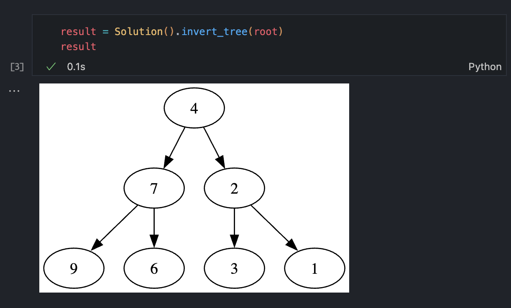
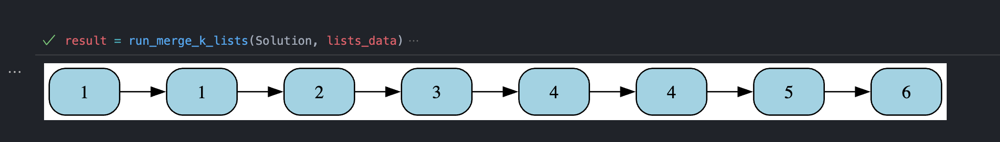
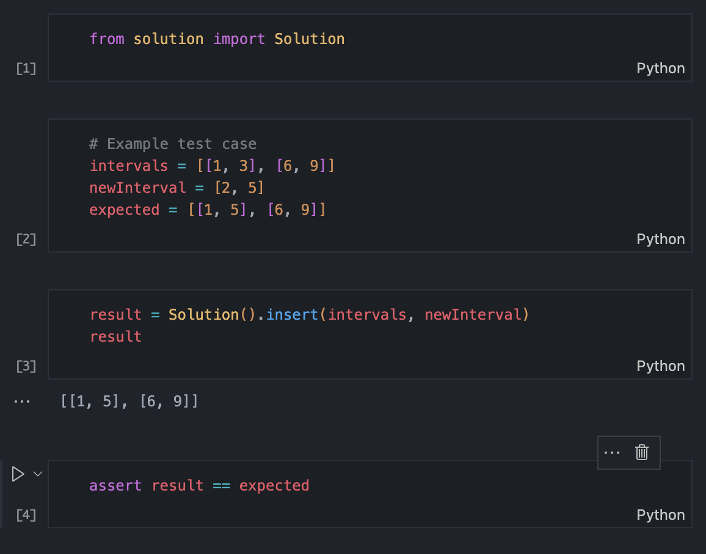

# LeetCode Practice Repository 🚀

[](https://sonarcloud.io/summary/new_code?id=wisarootl_leetcode-py)
[](https://sonarcloud.io/summary/new_code?id=wisarootl_leetcode-py)
[](https://sonarcloud.io/summary/new_code?id=wisarootl_leetcode-py)
[](https://codecov.io/gh/wisarootl/leetcode-py)
[](https://github.com/wisarootl/zerv/actions/workflows/ci-test.yml)
[](https://github.com/wisarootl/zerv/actions/workflows/cd.yml)

A modern Python LeetCode practice environment that goes beyond basic problem solving. Features automated problem generation from LeetCode URLs, beautiful data structure visualizations (TreeNode, ListNode, GraphNode), and comprehensive testing with 12+ test cases per problem. Built with professional development practices including CI/CD, type hints, and quality gates.

**What makes this different:**

- 🤖 **LLM-Assisted Workflow**: Generate new problems instantly with AI assistance
- 🎨 **Visual Debugging**: Interactive tree/graph rendering with Graphviz and anytree
- 🧪 **Production Testing**: Comprehensive test suites with edge cases and reproducibility verification
- 🚀 **Modern Python**: PEP 585/604 type hints, Poetry, and professional tooling
- 📊 **Quality Assurance**: 95%+ test coverage, security scanning, automated linting

## 🎯 What's Included

**Current**: All 75 problems from [Grind 75](https://www.techinterviewhandbook.org/grind75/) - the most essential coding interview questions curated by the creator of Blind 75.

**Future**: Planned expansion to all 169 Grind problems for comprehensive interview preparation.

## 🚀 Quick Start

```bash
# Clone and setup
git clone https://github.com/wisarootl/leetcode-py.git
cd leetcode-py
poetry install

# Start with existing Grind 75 problems
make gen-all-problems  # Regenerates all problems with TODO placeholders

# Practice a specific problem
make p-test PROBLEM=two_sum
# Edit leetcode/two_sum/solution.py, then rerun tests

# Run all tests
make test
```

## 📋 Prerequisites

- Python 3.13+
- Poetry, Make, Git, Graphviz

## 📁 Problem Structure

Each problem follows a consistent, production-ready template:

```
leetcode/two_sum/
├── README.md           # Problem description with examples and constraints
├── solution.py         # Implementation with type hints and TODO placeholder
├── test_solution.py    # Comprehensive parametrized tests (12+ test cases)
├── helpers.py          # Test helper functions
├── playground.py       # Interactive debugging environment (converted from .ipynb)
└── __init__.py         # Package marker
```

## ✨ Key Features

### Production-Grade Development Environment

- **Modern Python**: PEP 585/604 type hints, snake_case conventions
- **Comprehensive Linting**: black, isort, ruff, mypy with nbqa for notebooks
- **High Test Coverage**: 12+ test cases per problem including edge cases
- **Beautiful Logging**: loguru integration for enhanced test debugging
- **CI/CD Pipeline**: Automated testing, security scanning, and quality gates

### Enhanced Data Structure Visualization

- **TreeNode**: Beautiful tree rendering with anytree and Graphviz
- **ListNode**: Clean arrow-based visualization (`1 -> 2 -> 3`)
- **Interactive Debugging**: Multi-cell playground environment


_Beautiful tree rendering with anytree and Graphviz_


_Clean arrow-based list visualization_

### Flexible Notebook Support

- **Template Generation**: Creates Jupyter notebooks (`.ipynb`) by default
- **Repository State**: This repo uses Python files (`.py`) for better version control
- **User Choice**: Use `make nb-to-py` to convert notebooks to Python files, or keep as `.ipynb` for interactive development


_Interactive multi-cell playground for each problem_

## 🔄 Usage Patterns

### For Current Grind 75 Problems

Perfect if you want to focus on the most essential interview problems:

```bash
# Regenerate all 75 problems with fresh TODO placeholders
make gen-all-problems

# Work through problems systematically
make p-test PROBLEM=two_sum
make p-test PROBLEM=valid_palindrome
make p-test PROBLEM=merge_two_sorted_lists
```

### For Additional Problems (LLM-Assisted)

If you need more problems beyond Grind 75, use an LLM assistant in your IDE (Cursor, GitHub Copilot Chat, Amazon Q, etc.):

```bash
# Example commands to give your LLM assistant:
"Create LeetCode problem 146 (LRU Cache)"
"Add problem 'Word Ladder' by number 127"
"Generate problem 'Serialize and Deserialize Binary Tree'"

# For test enhancement (when you need more comprehensive test coverage):
"Enhance test cases for two_sum problem"
"Fix test reproducibility for binary_tree_inorder_traversal"
```

**Required LLM Context**: Include these rule files in your LLM context for automated problem generation and test enhancement:

- [`.amazonq/rules/problem-creation.md`](.amazonq/rules/problem-creation.md) - Complete problem generation workflow
- [`.amazonq/rules/test-case-enhancement.md`](.amazonq/rules/test-case-enhancement.md) - Test enhancement and reproducibility verification

**Manual Check**: Find problems needing more test cases:

```bash
poetry run python .templates/check_test_cases.py --threshold=10
```

## 🧰 Helper Classes

- **TreeNode**: `from leetcode_py import TreeNode`
    - Array ↔ tree conversion: `TreeNode.from_list([1,2,3])`, `tree.to_list()`
    - Beautiful anytree text rendering and Graphviz SVG for Jupyter
    - Node search: `tree.find_node(value)`
    - Generic type support: `TreeNode[int]`, `TreeNode[str]`

- **ListNode**: `from leetcode_py import ListNode`
    - Array ↔ list conversion: `ListNode.from_list([1,2,3])`, `node.to_list()`
    - Cycle detection with Floyd's algorithm
    - Graphviz visualization for Jupyter notebooks
    - Generic type support: `ListNode[int]`, `ListNode[str]`

- **GraphNode**: `from leetcode_py import GraphNode`
    - Adjacency list conversion: `GraphNode.from_adjacency_list([[2,4],[1,3],[2,4],[1,3]])`
    - Clone detection: `original.is_clone(cloned)`
    - Graphviz visualization for undirected graphs
    - DFS traversal utilities

- **DictTree**: `from leetcode_py.data_structures import DictTree`
    - Perfect for Trie implementations: `DictTree[str]()`
    - Beautiful tree rendering with box-drawing characters
    - Graphviz visualization for Jupyter notebooks
    - Generic key type support

## 🛠️ Development Commands

```bash
# Problem-specific operations
make p-test PROBLEM=problem_name    # Test specific problem
make p-gen PROBLEM=problem_name     # Generate problem from JSON template
make p-lint PROBLEM=problem_name    # Lint specific problem

# Bulk operations
make test                           # Run all tests
make lint                           # Lint entire codebase
make gen-all-problems              # Regenerate all problems (destructive)
```

## 🏗️ Architecture

- **Template-Driven**: JSON templates in `.templates/leetcode/json/` drive code generation
- **Cookiecutter Integration**: Uses `.templates/leetcode/{{cookiecutter.problem_name}}/` template for consistent file structure
- **Automated Scraping**: LLM-assisted problem data extraction from LeetCode
- **Version Control Friendly**: Python files by default, optional notebook support

## 📊 Quality Metrics

- **Test Coverage**: 95%+ with comprehensive edge case testing (Codecov integration)
- **Security**: SonarCloud quality gates, Trivy dependency scanning, Gitleaks secret detection
- **Code Quality**: Automated linting with black, isort, ruff, mypy
- **Test Reproducibility**: Automated verification that problems can be regenerated consistently
- **CI/CD**: GitHub Actions for testing, security, pre-commit hooks, and release automation

Perfect for systematic coding interview preparation with professional development practices and enhanced debugging capabilities.
